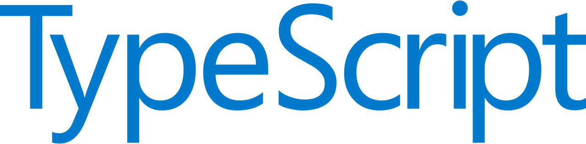

# 🖥️ ES6 Features

<h1 align="center">
  
</h1>

## 🔎️ Description
An app to learn the ES6 features on TypeScript.

This project was made during the <a href="https://www.udemy.com/course/understanding-typescript/">Understanding TypeScript</a> course on Udemy.

## 🚀️ Technologies

- HTML
- JavaScript
- TypeScript
 
---

Thank you and good coding 😎️

Made by **<a href="https://paulophlp.github.io/portfolio/" target="__blank">Paulo Lima 🤓️</a>**